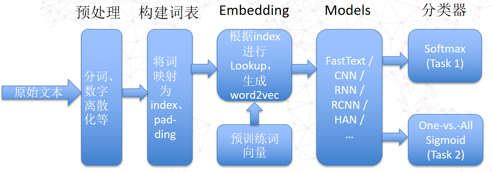

# BDCI2017-MingLue
BDCI2017，让AI当法官：http://www.datafountain.cn/#/competitions/277/intro

## 代码运行环境说明

* 操作系统：Ubuntu
* GPU显存：12G
* CUDA版本：8.0
* Python版本：3.5
* 依赖库：
    * `numpy` 1.13.3
    * `gensim` 3.1.0
    * `jieba` 0.39
    * `torch` 0.2.0

## 任务说明

- Task 1: 罚金等级预测 
- Task 2: 法条预测
##基本思路




### 分类器

任务1的罚金等级预测可以看作**文本多分类问题**，任务2的法条预测可以看作**文本多标签分类问题** 。

- 对于多分类问题，可以使用softmax函数作为分类器，最小化[**交叉熵（Cross Entropy）**](http://www.cnblogs.com/llhthinker/p/7287029.html)
- 对于多标签分类问题，可以one-versus-all策略，具体地，训练时可以使用pytorch中的[MultiLabelSoftMarginLoss](http://pytorch.org/docs/0.3.0/nn.html#multilabelsoftmarginloss)函数，预测时可以使用sigmoid函数：
  - 若某个标签对应的sigmoid函数的输出值 > 阈值(如0.5)：则该标签加入预测的标签集合，否则不加入。

### 特征提取

- **传统方法**：n-gram + TFIDF + LDA (在实验阶段尝试过，最后没有使用)
- **深度学习方法** (基于word2vec): 
  1. 将所有词（或词频>阈值的词）组成一个词表，得到word2index字典和index2word字典；
  2. 将词映射为index，并且进行padding，然后通过词对应的index对词向量矩阵进行Lookup，得到当前文本对应的word2vec；
  3. 使用FastText、CNN、RNN、RCNN、HAN等模型在word2vec的基础上进行特征提取。

### 优化思路

- 预处理
  - 数字离散化
  - 文本中的无用信息替换：如人名、地名等
  - 数据增强: 同义词/同义短语替换
- 多模型融合: 预测时，将多个模型的预测值的均值作为最终的预测结果
- 如何解决不均匀分类问题
  - 调整Loss函数中不同标签样本权重
  - 过采样
  - 欠采样 （未采用）
- 混合要素模型 （未采用）
- 混合paragraph vector （未采用）
- Inception in CNN
- 卷积层个数：单层 vs. 多层 (未尝试)
- 全连接层个数：单层 vs. 多层 （未尝试）

## 代码文件夹说明
- **preprocessor: 存放数据预处理相关的代码**
    - builddataset.py: 将文本数据转化为索引数值，用于Task 1
    - buildmultidataset.py: 将文本数据转化为索引数值，用于Task 2
    - segtext.py: 分词
    ```
    python ./segtext.py -i [input-file-path] -o [output-file-path]
    ```
    - shuffledata.py: 将文本按行随机打乱
    ```
    python ./shuffledata.py -i [input-file-path] -o [output-file-path]
    ```
    - trainword2vecmodel.py: 根据训练集[train-file]和测试集[test-file]生成[word2vec-model]，用于pretrain
    ```
    python ./trainword2vecmodel.py --word2vec-model-path [word2vec-model] --train-file [train-file] --test-file [test-file]
    ```

    - [更进一步预处理：数字离散化、命名实体替换等](https://github.com/llhthinker/BDCI2017-MingLue/tree/master/preprocessor/recognize)

- **utils: 存放一些工具类的代码**

    - calculatescore.py: 计算得分Micro-Averaged F1(Task 1)和Jaccard(Task 2)
    - statisticdata.py: 对数据进行一些统计分析
    - trainhelper.py: 训练需要的一些函数
    - multitrainhelper.py: Task 2训练需要的一些函数

- **models: 各种DL模型代码**

    | model\_id |                      code\_file\_name |   model\_name   |
    | --------- | ------------------------------------: | :-------------: |
    | 0         |                           fasttext.py |    FastText     |
    | 1         |                            textcnn.py |     TextCNN     |
    | 2         |                           textrcnn.py |    TextRCNN     |
    | 3         |                            textrnn.py |     TextRNN     |
    | 4         | hierarchical.py/ hierarchical_mask.py |       HAN       |
    | 5         |                     cnnwithdoc2vec.py | CNNWithDoc2Vec  |
    | 6         |                    rcnnwithdoc2vec.py | RCNNWithDoc2Vec |
    | ...       |                                   ... |       ...       |

    - 单独使用HAN模型，参见队友zxsong的repo: [Hierarchical-Attention-Network](https://github.com/szxSpark/Hierarchical-Attention-Network) 

- **data: 将数据包装成pytorch中的Dataset**

    - mingluedata.py: **Task 1**
    - mingluemultidata.py: **Task 2**

- **notebooks: 用jupyter notebook做一些实验**

- **主目录: 存放训练和预测运行代码和相关配置代码**
    - train.py: Task 1 训练脚本
    ```
    python ./train.py --model-id [model_id] --use-element [y/n] --is-save [y/n]
    ```
    - multitrain.py: Task 2 训练脚本
    ```
    python ./multitrain.py --model-id [model_id] --use-element [y/n] --is-save [y/n]
    ```
    - predict.py: 预测脚本，载入已有模型进行预测并生成json格式的结果文件
    ```
    # 注意model_id要和model_path对应的Model保持一致
    python ./predict.py --task1-model-id [model_id] --task1-model-path [model_path] --task2-model-id [model_id] --task2-model-path [model_path]
    ```
    - predict_task1.py: task1预测脚本，载入已有task1模型进行预测并生成json格式的结果文件

    ```
    # 注意model_id要和model_path对应的Model保持一致
    python ./predict_task1.py --task1-model-id [model_id] --task1-model-path [model_path]
    ```

    - predict_task2.py: task2预测脚本，载入已有task2模型进行预测并生成json格式的结果文件

    ```
    # 注意model_id要和model_path对应的Model保持一致
    python ./predict_task2.py --task2-model-id [model_id] --task2-model-path [model_path]
    ```

    - mix_predict_task1.py: task1模型融合预测脚本，载入针对task1训练后的RCNN和HAN模型进行融合预测并生成json格式的结果文件

    ```
    python ./mix_predict_task1.py --rcnn-model-path [RCNN_model_path]  --han-model-path [HAN_model_path]
    ```

    - mix_predict_task2.py: task2模型融合预测脚本，载入针对task2训练后的RCNN和HAN模型进行融合预测并生成json格式的结果文件

    ```
    python ./mix_predict_task2.py --rcnn-model-path [RCNN_model_path]  --han-model-path [HAN_model_path]
    ```

    - config.py: 配置文件，其中Config类对应Task 1, MultiConfig类对应Task 2

## 数据文件夹说明
- **corpus: 存放训练数据和测试数据**
- **pickles: 存放pickle类型数据，包括：**
    - index2word.[*.]pkl
    - word2index.[*.]pkl
    - 保存的模型数据:
        - \*.[model_name]表示Task 1的模型文件, 如params.pkl.1511507513.TextCNN
        - \*.multi.[model_name]表示Task 2的模型文件,如params.pkl.1511514902.multi.TextCNN
    - ...
- **word2vec: 存放pre-train word embedding相关数据**
- **results: 存放预测结果文件(json)**